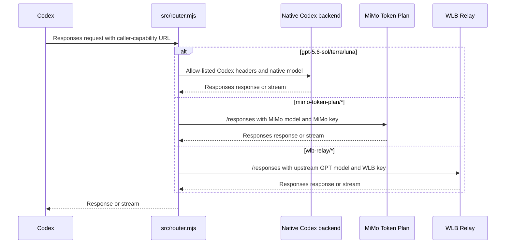

# How Codex Router works

Codex Router Lite is one local Node router. Codex keeps using its built-in
`openai` provider, but its managed `openai_base_url` points to the router and
its `model_catalog_json` points to the generated catalog. The router chooses
native or routed handling from the requested model slug.

## Request flow



`src/start.mjs` supervises this single router child and waits for its health
endpoint. It also supplies the proxy environment used by Node's `fetch`; no
gateway, API forwarder, Python process, OAuth flow, tray app, or updater is in
the request path.

## Catalog construction

`src/model-registry.mjs` loads the two provider descriptors and their model
fragments from `config/`. It validates provider IDs, namespaced slugs, upstream
model names, and listed metadata. The only providers are:

| Provider | Base URL source | Credential file |
| --- | --- | --- |
| `mimo-token-plan` | `config/mimo/mimo.json` | `mimo-api-key.secret` |
| `wlb-relay` | `config/wlb/wlb.json` | `wlb-api-key.secret` |

`src/catalog.mjs` captures the native result of `codex debug models` into
`native-models.json`, then writes `merged-models.json`. A signed-in catalog has
exactly eight entries:

| Kind | Entries | Count |
| --- | --- | ---: |
| Native GPT-5.6 | `gpt-5.6-sol`, `gpt-5.6-terra`, `gpt-5.6-luna` | 3 |
| MiMo | `mimo-token-plan/mimo-v2.5-pro`, `mimo-token-plan/mimo-v2.5` | 2 |
| WLB | `wlb-relay/gpt-5.6-sol`, `wlb-relay/gpt-5.6-terra`, `wlb-relay/gpt-5.6-luna` | 3 |

The five namespaced entries are routed; the three native entries are emitted
from the official native capture. Other captured native models remain available
as lookup data but are not emitted.

WLB is metadata-compatible by construction. For each WLB model, `upstreamModel`
must exactly match a native slug. The catalog copies that native object and
changes only the namespaced `slug` and WLB `display_name`; a missing exact match
fails the build.

MiMo is not a native-template clone. Its catalog object is built from the
explicit Xiaomi field set:

```text
slug, display_name, description, default_reasoning_level,
supported_reasoning_levels, shell_type, visibility, supported_in_api, priority,
base_instructions, supports_reasoning_summaries, default_reasoning_summary,
support_verbosity, truncation_policy, supports_parallel_tool_calls,
supports_image_detail_original, context_window, max_context_window,
effective_context_window_percent, experimental_supported_tools, input_modalities,
supports_search_tool
```

This keeps GPT-only fields such as `model_messages`, `comp_hash`, and
`multi_agent_version` out of the MiMo entries.

## Routing and credentials

For a native slug, `src/router.mjs` forwards the request to the native Codex
backend with the allow-listed Codex headers. For a namespaced slug, it resolves
the provider, replaces the model with `upstreamModel`, reads the selected key,
and sends a direct `POST <provider base URL>/responses` with a provider
`Authorization` header. Codex account and installation credentials are not sent
to routed providers. Streams are passed through; `/responses/compact` uses the
same direct path and creates a router-owned continuation summary when required.

Provider keys normally live in the protected state directory
(`~/.codex/codex-router/` by default). `provider-key set` writes the key and
enables that provider; an environment key remains useful for a foreground
process but is not automatically inherited by a background service.

The router listens on loopback and checks its per-install caller capability
before reading a request. `src/start.mjs` sets `NODE_USE_ENV_PROXY=1` and passes
`HTTP_PROXY`/`HTTPS_PROXY` to upstream fetches. The configured proxy defaults to
`http://127.0.0.1:7897`; provider URLs and TLS behavior remain controlled by the
provider registry and normal Node HTTPS verification.

## Maintenance and checks

After editing a model fragment, run:

```sh
node src/catalog.mjs
node test/catalog-metadata.mjs
node scripts-check.mjs
```

Reload the router process after the catalog changes (for an installed service,
`node src/service.mjs restart`). Fully restart Codex if its picker still shows
an older `model_catalog_json`. The native capture is refreshed automatically
when the Codex CLI version changes, subject to the same reload/restart step.

The main files are:

| File | Responsibility |
| --- | --- |
| `src/router.mjs` | Caller authentication, model dispatch, direct forwarding, streams, and compaction |
| `src/catalog.mjs` | Native capture and eight-entry merged catalog |
| `src/model-registry.mjs` | Provider/model loading and validation |
| `src/start.mjs` | One-child supervisor and proxy environment |
| `config/mimo/`, `config/wlb/` | The two provider descriptors and model fragments |
| `test/catalog-metadata.mjs` | WLB clone and MiMo field-set assertions |
