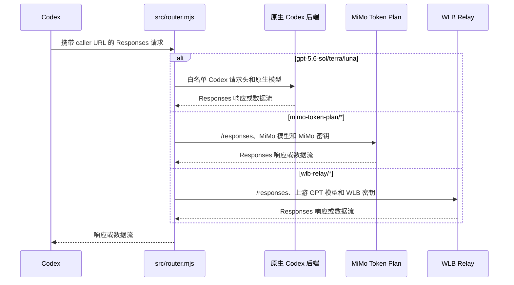

# Codex Router 工作原理

Codex Router Lite 只包含一个本地 Node 路由器。Codex 继续使用内置的 `openai`
服务商，但由路由器管理的 `openai_base_url` 指向本地路由器，
`model_catalog_json` 指向生成的模型目录。路由器根据请求中的模型 slug 选择原生
处理或第三方路由处理。

## 请求流程



`src/start.mjs` 监督这一个路由器子进程，并等待其健康检查通过。它还为 Node 的
`fetch` 提供代理环境。请求路径中没有网关、API 转发器、Python 进程、OAuth
流程、托盘应用或更新器。

Windows 后台服务由 `src/service-windows.mjs` 通过计划任务管理。后台启动的
`src/start.mjs` 会将监督进程 PID 原子写入 `service.pid`；停止或重启时，服务管理器
先核对 Node 可执行文件和完整的 `src/start.mjs` 命令行，再结束整个进程树。旧启动器
没有 PID 文件时，只按精确的 `wscript -> cmd -> start.mjs` 父子链查找一次，避免误杀
无关的 Node 进程，也避免旧路由器继续占用 4102 端口。

## 构建模型目录

`src/model-registry.mjs` 从 `config/` 加载两个服务商描述文件及其模型片段，并验证
服务商 ID、带命名空间的 slug、上游模型名称和已列出的元数据。仅支持以下服务商：

| 服务商 | 基础 URL 来源 | 凭据文件 |
| --- | --- | --- |
| `mimo-token-plan` | `config/mimo/mimo.json` | `mimo-api-key.secret` |
| `wlb-relay` | `config/wlb/wlb.json` | `wlb-api-key.secret` |

`src/catalog.mjs` 将 `codex debug models` 返回的原生目录保存到
`native-models.json`，再生成 `merged-models.json`。登录状态下的目录固定包含
8 个条目：

| 类型 | 条目 | 数量 |
| --- | --- | ---: |
| 原生 GPT-5.6 | `gpt-5.6-sol`、`gpt-5.6-terra`、`gpt-5.6-luna` | 3 |
| MiMo | `mimo-token-plan/mimo-v2.5-pro`、`mimo-token-plan/mimo-v2.5` | 2 |
| WLB | `wlb-relay/gpt-5.6-sol`、`wlb-relay/gpt-5.6-terra`、`wlb-relay/gpt-5.6-luna` | 3 |

5 个带命名空间的条目由路由器转发；3 个原生条目来自官方原生捕获。其他被捕获的
原生模型只保留为查找数据，不会输出到合并目录。

WLB 的元数据通过构建规则保证兼容。每个 WLB 模型的 `upstreamModel` 必须精确匹配
一个原生 slug。目录生成器复制该原生对象，只修改带命名空间的 `slug` 和 WLB
`display_name`；找不到精确匹配时构建会失败。

MiMo 不复制原生模板。其模型目录对象只由 Xiaomi 明确指定的以下字段组成：

```text
slug, display_name, description, default_reasoning_level,
supported_reasoning_levels, shell_type, visibility, supported_in_api, priority,
base_instructions, supports_reasoning_summaries, default_reasoning_summary,
support_verbosity, truncation_policy, supports_parallel_tool_calls,
supports_image_detail_original, context_window, max_context_window,
effective_context_window_percent, experimental_supported_tools, input_modalities,
supports_search_tool
```

因此，`model_messages`、`comp_hash` 和 `multi_agent_version` 等 GPT 专属字段不会
进入 MiMo 条目。

## 路由和凭据

对于原生 slug，`src/router.mjs` 使用白名单 Codex 请求头将请求转发给原生 Codex
后端；独立的 `/alpha/search` 搜索请求和图片请求也只会转发给原生后端。对于带命名
空间的 slug，它会解析服务商，将模型名替换为 `upstreamModel`，
读取对应密钥，再使用服务商的 `Authorization` 请求头直接发送
`POST <provider base URL>/responses`。Codex 的账户和安装凭据不会发送给第三方
服务商。数据流会直接透传；`/responses/compact` 使用相同的直连路径，并在需要时
生成由路由器管理的续接摘要。

响应流连续 300 秒没有任何数据时，路由器会取消上游请求。SSE 会收到固定的
terminal error；尚未开始的非 SSE 响应会返回 504。该空闲时限可通过
`CODEX_ROUTER_STREAM_IDLE_TIMEOUT_MS` 在 10 毫秒至 15 分钟之间调整，收到每个
chunk 后都会重新计时，因此不会限制持续输出请求的总时长。

服务商密钥通常保存在受保护的状态目录中（默认为
`~/.codex/codex-router/`）。`provider-key set` 会写入密钥并启用该服务商；环境
变量密钥可供前台进程使用，但后台服务不会自动继承。

路由器只监听回环地址，并在读取请求前检查每次安装生成的 caller 凭据。
`src/start.mjs` 设置 `NODE_USE_ENV_PROXY=1` 并将 `HTTP_PROXY`/`HTTPS_PROXY`
传递给上游 fetch。代理默认是 `http://127.0.0.1:7897`；服务商 URL 和 TLS 行为
仍由服务商注册表及 Node 的正常 HTTPS 验证控制。

## 维护和检查

修改模型片段后运行：

```sh
node src/catalog.mjs
node test/catalog-metadata.mjs
node --test test/router-fixes.mjs test/windows-service-process.mjs
node scripts-check.mjs
```

日常只读检查使用 `codex-router.ps1 status`（Windows）或
`bin/model-router codex status`（POSIX）；它只读取本地健康端点、Codex 配置、固定
8 模型目录、Provider 凭据状态、安装清单和后台服务，不会自动修复或请求上游。

模型目录变化后必须重载路由器进程；已安装的服务可运行
`node src/service.mjs restart`。如果 Codex 的模型选择器仍显示旧的
`model_catalog_json`，请完全重启 Codex。Codex CLI 版本变化时会自动刷新原生
捕获，但仍需要执行相同的重载/重启步骤。

主要文件如下：

| 文件 | 职责 |
| --- | --- |
| `src/router.mjs` | caller 验证、模型分发、原生搜索/图片、直接转发、数据流和压缩摘要 |
| `src/response-usage.mjs` | 从 JSON 或 SSE 响应提取 Token 用量并保持响应透传 |
| `src/catalog.mjs` | 捕获原生目录并生成 8 条目的合并目录 |
| `src/model-registry.mjs` | 加载并验证服务商和模型 |
| `src/start.mjs` | 监督一个路由器子进程并提供代理环境 |
| `src/status.mjs` | 只读汇总路由器、配置、目录、Provider、安装和服务状态 |
| `src/service-windows.mjs` | 管理 Windows 计划任务并安全停止已验证的监督进程树 |
| `config/mimo/`、`config/wlb/` | 两个服务商的描述文件和模型片段 |
| `test/catalog-metadata.mjs` | 检查 WLB 精确复制和 MiMo 字段集合 |
| `test/router-fixes.mjs` | 检查路由、统计、脱敏、有界错误和流式 idle timeout |
| `test/windows-service-process.mjs` | 检查 Windows PID 登记、进程树停止和误杀防护 |
