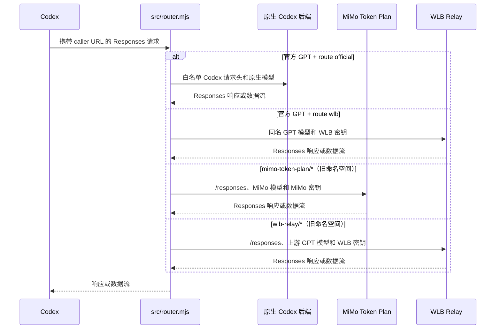

# Codex Router 工作原理

Codex Router Lite 只包含一个本地 Node 路由器。Codex 继续使用内置的 `openai`
服务商，但由路由器管理的 `openai_base_url` 指向本地路由器。默认安装不写入
`model_catalog_json`，因此 Codex 继续使用并自行更新官方模型目录。路由器根据请求
中的模型 slug 和全局 GPT 路由设置选择官方处理或第三方路由处理。

## 请求流程



`src/start.mjs` 监督这一个路由器子进程，并等待其健康检查通过。每次健康探针的超时
不会超过整体等待 deadline，成功响应会排空响应体以保持连接可复用；路由器对客户端连接池使用 120 秒 keep-alive，并为中途
断流写入独立的 usage 标记。收到 `SIGINT`/`SIGTERM` 时，路由器停止接收新请求，
在途请求最多 drain 2 秒；已开始的 SSE 会收到本地重启 terminal error 后 clean EOF，
尚未发送响应头的请求返回 503。`src/start.mjs` 的强杀 backstop 会覆盖 drain 和 flush
窗口；`MODEL_ROUTER_SHUTDOWN_DRAIN_MS` 可调整 drain 时长。它还为 Node 的 `fetch`
提供代理环境。请求路径中没有网关、API 转发器、Python 进程、OAuth 流程、托盘应用
或更新器。

Windows 后台服务由 `src/service-windows.mjs` 通过计划任务管理。后台启动的
`src/start.mjs` 会将监督进程 PID 原子写入 `service.pid`；停止或重启时，服务管理器
先核对 Node 可执行文件和完整的 `src/start.mjs` 命令行，再结束整个进程树。旧启动器
没有 PID 文件时，只按精确的 `wscript -> cmd -> start.mjs` 父子链查找一次，避免误杀
无关的 Node 进程，也避免旧路由器继续占用 4102 端口。

## 官方目录与旧模型目录

`src/model-registry.mjs` 从 `config/` 加载两个服务商描述文件及其模型片段，并验证
服务商 ID、带命名空间的 slug、上游模型名称和已列出的元数据。仅支持以下服务商：

| 服务商 | 基础 URL 来源 | 凭据文件 |
| --- | --- | --- |
| `mimo-token-plan` | `config/mimo/mimo.json` | `mimo-api-key.secret` |
| `wlb-relay` | `config/wlb/wlb.json` | `wlb-api-key.secret` |

默认安装不构建静态目录，也不向 Codex 写入 `model_catalog_json`；官方模型选择器
由 Codex 自己维护。`src/catalog.mjs` 仍保留给需要旧命名空间目录的手动构建，且
只有这种手动旧目录构建才固定包含 8 个条目：

| 类型 | 条目 | 数量 |
| --- | --- | ---: |
| 原生 GPT-5.6 | `gpt-5.6-sol`、`gpt-5.6-terra`、`gpt-5.6-luna` | 3 |
| MiMo | `mimo-token-plan/mimo-v2.5-pro`、`mimo-token-plan/mimo-v2.5` | 2 |
| WLB | `wlb-relay/gpt-5.6-sol`、`wlb-relay/gpt-5.6-terra`、`wlb-relay/gpt-5.6-luna` | 3 |

5 个带命名空间的条目由路由器转发；3 个原生条目来自官方原生捕获。其他被捕获的
原生模型只保留为查找数据，不会输出到这个旧合并目录。旧目录不会成为默认官方
模型选择器的来源。

手动构建旧目录时，WLB 条目以捕获的官方目录中其 `upstreamModel` 对应条目为元数据
基线，保持字段和能力描述一致；这不保证 WLB 上游实际支持官方目录声明的全部能力。
每个 WLB 模型的 `upstreamModel` 必须精确匹配一个原生 slug；找不到对应官方条目时
构建会失败。目录生成器只修改带命名空间的 `slug` 和 WLB `display_name`。

MiMo 不复制原生模板。其模型目录对象只由 Xiaomi 明确指定的以下字段组成：

```text
slug, display_name, description, default_reasoning_level,
supported_reasoning_levels, shell_type, visibility, supported_in_api, priority,
base_instructions, supports_reasoning_summaries, default_reasoning_summary,
support_verbosity, truncation_policy, supports_parallel_tool_calls,
supports_image_detail_original, context_window, max_context_window,
effective_context_window_percent, experimental_supported_tools, input_modalities,
supports_search_tool
```

因此，`model_messages`、`comp_hash` 和 `multi_agent_version` 等 GPT 专属字段不会
进入 MiMo 条目。

## 路由和凭据

`src/gpt-route.mjs` 将 `official` 或 `wlb` 写入状态目录；文件不存在时默认使用
`official`。这是全局设置，不绑定线程，从下一次 GPT 请求起对所有任务生效。使用
`wlb` 时，`src/router.mjs` 只查找与官方请求模型同名、且已在 WLB 注册的模型；没有
对应模型时直接返回 `409`，不会回退到官方。正在执行的任务中途切换服务商可能带来
历史上下文兼容风险。`route status` 只读；`--json` 仅由总状态命令支持。

对于官方 GPT slug，`official` 路由使用白名单 Codex 请求头将请求转发给原生 Codex
后端；`wlb` 路由注入 WLB 密钥并使用同名的 WLB 模型。独立的 `/alpha/search` 搜索
请求和图片请求也只会转发给原生后端，并且必须
携带非空的 `Authorization`，否则本地直接返回 `401`，不访问上游。原生 SSE
已经观察到 `response.completed` 后，即使客户端紧接着关闭连接，也按 upstream status
和 Token usage 记录，不再误记为客户端取消或 `0`；尚未完成的 native 流仍记为客户端
取消。GPT-5.6 原生请求会删除旧兼容字段 `prompt_cache_retention`，不影响
`prompt_cache_options`。当会话从第三方模型切回原生 GPT 时，路由器只保留
`encrypted_content` 符合原生 `gAAAAA...` token 形状的 reasoning，并移除仅用于
输出的 `content`；没有原生加密上下文的外部 reasoning 会整项丢弃，避免
`store=false` 请求引用并未在 OpenAI 持久化的外部 `rs_*` item。对于带命名
空间的旧 slug，它会解析服务商，将模型名替换为 `upstreamModel`，
读取对应密钥，再使用服务商的 `Authorization` 请求头直接发送
`POST <provider base URL>/responses`。Codex 的账户和安装凭据不会发送给第三方
服务商。数据流会直接透传；`/responses/compact` 使用相同的直连路径，并在需要时
生成由路由器管理的续接摘要。

`GET /models` 和 `GET /v1/models` 始终使用官方身份透传到官方上游，并保留请求查询
参数和官方完整响应元数据；WLB 路由不会把模型列表替换成本地简化目录。没有当前
Codex 登录身份时，这两个端点返回 `401`。

上游省略 `content-type` 时，`src/sse-prefix.mjs` 会在最多 512 bytes 的前缀内识别
SSE。字段名可跨 chunk，开头允许 UTF-8 BOM、注释和空行；探测期间缓存的原始字节会
按顺序交回响应处理器。Token 用量统计和 MiMo custom tool 还原共用该判定，非 SSE
响应则保持原路径。第三方输入 Token 的兜底估算会扣除 `encrypted_content` 字符串值，
因为这些密文不是模型可见提示词；未知字段仍默认计入，保持向上估算。

MiMo 的 Responses 网关不接受 Codex 扩展的 `custom_tool_call` 和 `agent_message`。
路由器因此在 MiMo 路径上增加专属转换：custom tool 定义和历史调用以带单个
`input` 字符串参数的 function tool 上送，JSON/SSE 中对应的 function call 再还原为
custom tool 事件；普通 function tool 保持不变。标准协作 envelope 中的 `MESSAGE`
是未验收的中间进度，跨模型续接时不再回放；`FINAL_ANSWER`、`NEW_TASK`、
`FOLLOWUP_TASK` 及无法识别的类型仍保留。compact 路径应用同一规则。原生 GPT 和
WLB 不做这项 MiMo 专属裁剪或 custom-tool 映射。

第三方路由仍需回放的标准原生 `agent_message` envelope 可能只含不可由本地解开的
`encrypted_content`。路由器使用原生 Codex 后端的受控 function call 取回明文，
最多 4 路并发并按输入索引回填。明文只放在当前路由器进程的 LRU 缓存中，逻辑 TTL
为 24 小时，上限为 512 条或 8 MiB；不会主动持久化到模型目录、日志或凭据文件。
MiMo 裁掉旧 `MESSAGE` 进度后，新设备和服务重启后的首次续接通常无需解密这些
历史项；仍需解密的载荷由 4 路并发避免串行，LRU 则加速同一进程内的后续续接。

响应流连续 300 秒没有任何数据时，路由器会取消上游请求。SSE 会收到固定的
terminal error；尚未开始的非 SSE 响应会返回 504。该空闲时限可通过
`CODEX_ROUTER_STREAM_IDLE_TIMEOUT_MS` 在 10 毫秒至 15 分钟之间调整，收到每个
chunk 后都会重新计时，因此不会限制持续输出请求的总时长。

普通路由请求的第三方上游错误响应体最多读取 64 KiB；路由器会在翻译为 Codex 错误前遮盖
Bearer、token、key、secret、caller capability、查询参数和控制字符，并把错误详情
限制为短文本。可解析的 quoted JSON 字段会替换字段值而保留合法 JSON，避免凭据或
上游内部信息进入客户端响应。

服务商密钥通常保存在受保护的状态目录中（默认为
`~/.codex/codex-router/`）。`provider-key set` 会写入密钥并启用该服务商；环境
变量密钥可供前台进程使用，但后台服务不会自动继承。持久化凭据只从普通文件读取，
符号链接、目录和读取失败的候选会被忽略；Windows 写入会用仅含当前用户
`FullControl` 的非继承 DACL 替换现有 ACL。

请求正文超限后，路由器停止缓存新字节并排空剩余请求，客户端断开仍可中止读取。
协作载荷 relay 和 compact 响应分别最多缓冲 4 MiB 与 32 MiB，超限会立即取消上游
流；这些限制在数据到达时执行，不会先由 `arrayBuffer()` 无界收集。

路由器只监听回环地址，并在读取请求前检查每次安装生成的 caller 凭据。
`src/start.mjs` 设置 `NODE_USE_ENV_PROXY=1` 并将 `HTTP_PROXY`/`HTTPS_PROXY`
传递给上游 fetch。代理默认是 `http://127.0.0.1:7897`；服务商 URL 和 TLS 行为
仍由服务商注册表及 Node 的正常 HTTPS 验证控制。

## 维护和检查

修改模型片段或手动旧目录构建逻辑后运行：

```sh
node src/catalog.mjs
node test/catalog-metadata.mjs
node --test test/official-catalog.mjs
node --test test/router-fixes.mjs test/response-usage-hardening.mjs test/http-health-bounds.mjs test/credential-file-security.mjs test/graceful-shutdown.mjs test/upstream-hardening.mjs test/windows-service-process.mjs
node scripts-check.mjs
```

日常只读检查使用 `codex-router.ps1 status`（Windows）或
`bin/model-router codex status`（POSIX）；它只读取本地健康端点、Codex 配置、官方或
旧模型目录模式、Provider 凭据状态、安装清单和后台服务，不会自动修复或请求上游。
默认官方目录模式不要求静态 8 模型目录；手动旧目录模式才要求精确的 8 个目录 slug
（包括 5 个路由 slug）。健康检查、受管配置、未降级的 Provider 选择以及相应凭据
满足时，退出码才为 0；否则为 1，参数错误为 2。只有总状态命令支持 `--json`，即
`status --json`；`route status` 是只读文本查询，不接受 `--json`。

默认官方模型目录无需运行 `src/catalog.mjs`；Codex 会自行更新官方目录。需要维护
旧命名空间目录时才手动运行 `node src/catalog.mjs`，并按需要重载路由器；如果模型
选择器仍显示旧的手动目录，完全重启 Codex。

另一台设备不要复制其他设备的状态目录：仅使用官方路由时可直接运行
`.\codex-router.ps1 install`（POSIX 使用 `bin/install`）；需要第三方路由时再在本机
配置对应的 provider key，随后完全重启 Codex。
同一设备更换 checkout 时，POSIX installer 提供显式的所有权转移流程；Windows
installer 目前会拒绝 foreign state owner，应继续从原 checkout 更新或先人工解决
冲突。安装会确保本机 caller secret、配置 Codex endpoint，并登记后台服务，不会默认
写入 `model_catalog_json` 或构建静态目录。

主要文件如下：

| 文件 | 职责 |
| --- | --- |
| `src/router.mjs` | caller 验证、模型分发、原生搜索/图片、协作载荷 relay、直接转发、数据流和压缩摘要 |
| `src/mimo-custom-tools.mjs` | MiMo custom tool/agent message 的请求转换、历史裁剪和 JSON/SSE 响应还原 |
| `src/response-usage.mjs` | 从 JSON 或 SSE 响应提取 Token 用量并保持响应透传 |
| `src/sse-prefix.mjs` | 有界识别无 `content-type` 的 SSE 并保持探测字节顺序 |
| `src/catalog.mjs` | 为需要旧命名空间目录的手动流程捕获官方目录并生成 8 条目的合并目录 |
| `src/gpt-route.mjs` | 读写全局 GPT 路由状态，默认官方路由 |
| `src/model-registry.mjs` | 加载并验证服务商和模型 |
| `src/start.mjs` | 监督一个路由器子进程并提供代理环境 |
| `src/status.mjs` | 只读汇总路由器、配置、目录模式、GPT 路由、Provider、安装和服务状态 |
| `src/service-windows.mjs` | 管理 Windows 计划任务并安全停止已验证的监督进程树 |
| `config/mimo/`、`config/wlb/` | 两个服务商的描述文件和模型片段 |
| `test/catalog-metadata.mjs` | 检查 WLB 元数据基线和 MiMo 字段集合 |
| `test/official-catalog.mjs` | 检查官方目录状态、配置迁移及多代理子表去重 |
| `test/router-fixes.mjs` | 检查路由、MiMo 历史兼容、relay 并发/缓存、统计、脱敏、有界错误和流式 idle timeout |
| `test/response-usage-hardening.mjs` | 检查 split/BOM SSE、字节透传、MiMo 还原和密文 Token 估算 |
| `test/http-health-bounds.mjs` | 检查请求 drain/中止、响应超限取消和健康 deadline |
| `test/credential-file-security.mjs` | 检查凭据 symlink/非文件拒绝和 Windows ACL 规范化 |
| `test/graceful-shutdown.mjs` | 检查重启 drain、SSE terminal error、503 fallback 和 idle keep-alive 快速退出 |
| `test/upstream-hardening.mjs` | 检查健康响应排空、keep-alive 参数、错误 cause 链和断流 usage 标记 |
| `test/windows-service-process.mjs` | 检查 Windows PID 登记、进程树停止和误杀防护 |
